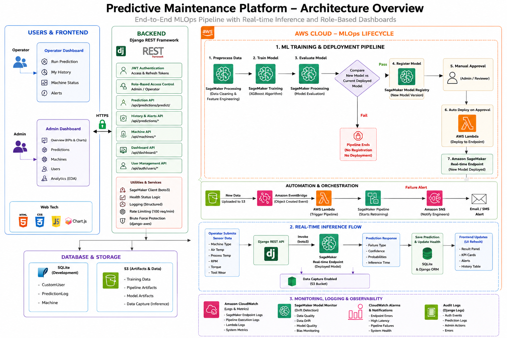

# PM Dashboard — Predictive Maintenance Platform

> **Real-time machine failure prediction powered by AWS SageMaker, Django REST Framework, and an enterprise-grade operator dashboard.**

[](https://www.python.org/)
[](https://www.djangoproject.com/)
[](https://www.django-rest-framework.org/)
[](https://aws.amazon.com/sagemaker/)
[](https://www.sqlite.org/)
[](https://jwt.io/)

---

## Project Overview

The PM Dashboard is a full-stack **predictive maintenance web application** designed for industrial manufacturing environments. It connects live sensor readings from factory machines to an ML inference endpoint on **AWS SageMaker**, predicts the probability and type of machine failure in real time, and surfaces the results through role-specific dashboards for operators and administrators.

The system models five distinct failure modes — Power Failure, Tool Wear Failure, Heat Dissipation Failure, Overstrain Failure, and Random Failure — against six sensor features derived from a manufacturing dataset. When a prediction is made, the machine's health status is updated automatically and failure alerts are raised, giving operations teams an early warning system before downtime occurs.

---

## Problem Statement

Unexpected machine failures lead to production downtime, maintenance costs, and operational losses in manufacturing environments. Traditional maintenance strategies either repair equipment only after failure or replace components on fixed schedules, often resulting in unnecessary maintenance or unexpected breakdowns.

Predictive Maintenance uses machine learning to analyse machine sensor readings and estimate the probability of future failures before they occur, enabling proactive maintenance planning and reducing downtime.

This project demonstrates an end-to-end predictive maintenance platform that combines machine learning, AWS MLOps, cloud deployment, and a secure full-stack web application into a single production-inspired system.

---

## Project Objectives

This project was designed to demonstrate an end-to-end production-inspired machine learning workflow rather than only training a predictive model.

The primary objectives are:

- Train an XGBoost multiclass predictive maintenance model.
- Deploy the model as an Amazon SageMaker Real-Time Endpoint.
- Automate the ML lifecycle using SageMaker Pipelines.
- Compare newly trained models against the currently deployed production model before deployment.
- Version production models using SageMaker Model Registry.
- Automate deployment using AWS Lambda after manual approval.
- Automatically retrain the pipeline whenever new training data is uploaded to Amazon S3.
- Monitor pipeline execution, deployments, and predictions using CloudWatch and Data Capture.
- Provide role-based dashboards for operators and administrators using Django REST Framework.

---

## Features

| Area | Capability |
|---|---|
| **Prediction** | Real-time inference via AWS SageMaker; 5-class failure classification with confidence scores and per-class probabilities |
| **Auth** | JWT access + refresh tokens; token blacklisting on logout; brute-force protection via `django-axes` |
| **RBAC** | Two roles: `admin` (full platform visibility) and `operator` (own data only) |
| **Operator Dashboard** | Prediction form, prediction history, machine status grid, failure alerts |
| **Admin Dashboard** | Fleet KPI cards, Chart.js visualisations (failure distribution, 7-day trend, machine health), user management |
| **Machine Health** | Per-machine health status (`healthy`, `at_risk`, `critical`) auto-updated after every prediction via Django signals |
| **Logging** | Structured per-app logging to console + `logs/app.log` for every auth event, prediction request, and SageMaker response |
| **API Security** | Rate limiting (100 req/min per user, 20 req/min anonymous), CORS header management, CSRF protection |
| **Seeding** | `python manage.py seed_data` bootstraps demo users and 10 sample machines |

---

## Tech Stack

### Backend

| Technology | Role |
|---|---|
| **Python 3.12** | Runtime |
| **Django 4.2** | Web framework, ORM, template rendering, URL routing, admin |
| **Django REST Framework 3.14** | REST API layer — serializers, generic views, authentication |
| **SimpleJWT 5.3** | JWT access/refresh token issuance, rotation, and blacklisting |
| **django-axes 6.3** | Brute-force login protection — locks account after 5 failed attempts |
| **django-cors-headers** | CORS policy management for API consumption from the browser |
| **python-decouple** | `.env` file management; keeps secrets out of source code |
| **boto3 1.34** | AWS SDK for Python — used exclusively to invoke the SageMaker runtime endpoint |

### Frontend

| Technology | Role |
|---|---|
| **HTML5** | Semantic markup for login, operator, and admin dashboard pages |
| **Vanilla CSS** | Custom design system with CSS variables, dark/light theming, responsive grids |
| **Vanilla JavaScript (ES2020)** | All interactivity — auth, section navigation, API calls, DOM rendering |
| **Chart.js** | Admin dashboard charts — failure type pie chart, machine health bar chart, 7-day prediction trend line chart |

### Cloud & ML

| Technology | Role |
|---|---|
| **AWS SageMaker Runtime** | Hosts the trained classification model as a real-time inference endpoint |
| **boto3 `invoke_endpoint`** | Sends a CSV-formatted sensor payload and receives a JSON prediction response |
| **XGBoost** | Underlying ML model trained on the UCI AI4I 2020 Predictive Maintenance Dataset and deployed to SageMaker |

### Database & Storage

| Technology | Role |
|---|---|
| **SQLite** | Default development database — all prediction logs, users, and machine records |
| **Django ORM** | Database abstraction; `JSONField` stores full raw SageMaker I/O for auditability |

---

## Project Structure

```
pm_dashboard/
│
├── config/                     # Django project configuration
│   ├── settings.py             # All settings: JWT, CORS, axes, AWS, logging
│   └── urls.py                 # Root URL router (API + HTML pages)
│
├── accounts/                   # Authentication & user management
│   ├── models.py               # CustomUser — extends AbstractUser with role field
│   ├── serializers.py          # JWT serializer (embeds role in token payload)
│   ├── views.py                # Login, logout, profile, user CRUD (admin only)
│   ├── permissions.py          # IsAdminRole, IsOperatorOrAdmin — DRF permission classes
│   └── urls.py                 # /api/auth/* routes
│
├── predictions/                # Core ML inference app
│   ├── models.py               # PredictionLog — every SageMaker call stored here
│   ├── serializers.py          # PredictionInputSerializer, PredictionLogSerializer
│   ├── views.py                # PredictView, PredictionHistoryView, RecentAlertsView
│   ├── signals.py              # post_save signal: auto-updates Machine health after prediction
│   └── urls.py                 # /api/predictions/* routes
│
├── machines/                   # Machine registry
│   ├── models.py               # Machine — machine_id, health status, location, type
│   ├── serializers.py          # MachineSerializer
│   ├── views.py                # MachineStatusView, MachineDetailView
│   └── management/commands/
│       └── seed_data.py        # python manage.py seed_data
│
├── dashboard/                  # Dashboard analytics & HTML page serving
│   ├── views.py                # DashboardStatsView, EDADataView, OperatorStatsView
│   │                           # + login_page, operator_dashboard_page, admin_dashboard_page
│   └── urls.py                 # /api/dashboard/* routes
│
├── templates/
│   ├── accounts/login.html     # Login page
│   └── dashboard/
│       ├── admin.html          # Admin dashboard SPA shell
│       └── operator.html       # Operator dashboard SPA shell
│
├── static/
│   ├── css/
│   │   ├── base.css            # Design tokens, typography, utilities
│   │   ├── sidebar.css         # Sidebar navigation layout
│   │   ├── login.css           # Login page styles
│   │   ├── operator.css        # Operator dashboard styles
│   │   └── admin.css           # Admin dashboard styles
│   ├── js/
│   │   ├── api.js              # Central DRF connector (token storage, auto-refresh, fetch wrapper)
│   │   ├── login.js            # Login form logic, role-based redirect
│   │   ├── operator.js         # Operator dashboard — prediction form, history, machines, alerts
│   │   └── admin.js            # Admin dashboard — stats, charts, user management
│   └── data/
│       └── eda_stats.json      # Pre-computed EDA statistics from training dataset
│
├── logs/
│   └── app.log                 # Structured application log (auth, predictions, errors)
│
├── db.sqlite3                  # SQLite database
├── manage.py
├── requirements.txt
└── .env.template               # Environment variable template
```

---

## System Architecture

```
┌──────────────────────────────────────────────────────────┐
│                  Browser Client                          │
│          (HTML + CSS + Vanilla JavaScript)               │
│                                                          │
│   ┌─────────────────┐      ┌────────────────────────┐   │
│   │  Operator Portal │      │     Admin Portal        │   │
│   │  - Predict form  │      │  - KPI cards + Charts   │   │
│   │  - History table │      │  - User management      │   │
│   │  - Machine cards │      │  - Machine fleet view   │   │
│   │  - Alert feed    │      │  - Prediction history   │   │
│   └────────┬────────┘      └────────────┬────────────┘   │
│            │   api.js — JWT Bearer token on every req     │
└────────────┼────────────────────────────┼────────────────┘
             │                            │
             ▼                            ▼
┌──────────────────────────────────────────────────────────┐
│                  Django REST Framework                   │
│                                                          │
│  ┌──────────┐  ┌───────────┐  ┌──────────┐  ┌────────┐  │
│  │ accounts │  │predictions│  │ machines │  │dashboard│  │
│  │   app    │  │    app    │  │   app    │  │  app   │  │
│  └──────────┘  └─────┬─────┘  └──────────┘  └────────┘  │
│                      │                                   │
│           ┌──────────▼──────────┐                        │
│           │   JWT Auth + RBAC   │                        │
│           │  (axes brute-force  │                        │
│           │    protection)      │                        │
│           └──────────┬──────────┘                        │
│                      │ boto3                             │
└──────────────────────┼───────────────────────────────────┘
                       ▼
          ┌────────────────────────┐
          │   AWS SageMaker        │
          │   Real-Time Endpoint   │
          │   (XGBoost model)      │
          └────────────┬───────────┘
                       │ JSON response
                       ▼
          ┌────────────────────────┐
          │  Response Parsing &    │
          │  Health Calculation    │
          └────────────┬───────────┘
                       │ Django ORM
                       ▼
          ┌────────────────────────┐
          │   SQLite Database      │
          │                        │
          │  • PredictionLog       │
          │  • Machine             │
          │  • CustomUser          │
          └────────────────────────┘
```

### Request Flow

```
User submits sensor data
         │
         ▼
  Frontend Validation
  (operator.js)
         │
         ▼
  POST /api/predictions/predict/
  Bearer <access_token>
         │
         ▼
  JWT Authentication
  (SimpleJWT middleware)
         │
         ▼
  RBAC Check
  IsOperatorOrAdmin
         │
         ▼
  PredictionInputSerializer
  (validates 6 sensor fields,
   range checks, type coercion)
         │
         ▼
  Build CSV payload
  (column order must match training data:
   Type, AirTemp, ProcessTemp, RPM, Torque, ToolWear)
         │
         ▼
  boto3 → SageMaker invoke_endpoint
  (inference time measured in ms)
         │
         ▼
  parse_sagemaker_response()
  (supports JSON dict, JSON list, plain int)
         │
         ▼
  determine_health_status()
  (maps failure type → healthy / at_risk / critical)
         │
         ▼
  PredictionLog.objects.create()
  (raw input + raw SageMaker output stored as JSONField)
         │
         ▼
  Django Signal: post_save
  → Machine.current_health_status updated
         │
         ▼
  JSON Response returned to frontend
  (prediction_id, failure_type, health_status,
   confidence, probabilities, inference_time_ms)
         │
         ▼
  Operator result panel rendered
  Alert badge incremented
  KPI cards refreshed
```

---

## Overall System Architecture

The following diagram illustrates the complete end-to-end architecture of the platform, including the frontend application, Django backend, AWS MLOps lifecycle, automated deployment workflow, real-time inference flow, monitoring components, and cloud infrastructure.



---

## AWS MLOps Lifecycle

Unlike traditional machine learning projects that stop after model training, this project implements a complete MLOps lifecycle covering data preprocessing, automated training, model evaluation, model versioning, deployment, monitoring, and continuous retraining.

The AWS workflow consists of three major components:

- Model Training & Deployment Pipeline
- Real-Time Inference Pipeline
- Monitoring & Continuous Retraining

### Model Training Pipeline

The SageMaker Pipeline executes the following stages:

1. **Data Preprocessing**
   - Cleans the AI4I Predictive Maintenance dataset.
   - Performs feature engineering and dataset splitting.
   - Stores processed datasets in Amazon S3.

2. **Model Training**
   - Trains an XGBoost multiclass classifier using SageMaker Training Jobs.
   - Stores trained model artifacts in Amazon S3.

3. **Model Evaluation**
   - Evaluates the newly trained model using the test dataset.
   - Computes metrics including AUC, F2 Score, F1 Score, Accuracy, Precision, Recall, and Confusion Matrix.
   - Writes all evaluation metrics to `evaluation.json`.

4. **Champion vs Challenger Validation**
   - Retrieves the currently approved production model from SageMaker Model Registry.
   - Compares the new model against the deployed model.
   - Deployment is approved only if:
     - AUC does not decrease.
     - F2 Score improves.

5. **Conditional Registration**
   - If the quality gate passes, the model is automatically registered as a new version in SageMaker Model Registry.
   - If the comparison fails, the pipeline ends without registering or deploying the model.

6. **Manual Approval**
   - A reviewer manually approves the registered model before production deployment.

7. **Automatic Deployment**
   - After approval, EventBridge triggers AWS Lambda.
   - Lambda automatically deploys the approved model to the SageMaker Real-Time Endpoint.

---

## Continuous Retraining

The project also demonstrates automated retraining.

Whenever a new dataset is uploaded to the configured Amazon S3 location:

```text
Amazon S3
      ↓
Amazon EventBridge
      ↓
AWS Lambda
      ↓
SageMaker Pipeline
      ↓
Train New Model
      ↓
Compare With Current Production Model
      ↓
Conditional Deployment
```

This enables continuous improvement of the deployed model whenever new training data becomes available.

---

## Real-Time Inference Workflow

The training pipeline is completely independent from real-time inference.

During prediction:

1. An operator submits machine sensor values through the dashboard.
2. Django REST Framework validates the request.
3. boto3 invokes the Amazon SageMaker Real-Time Endpoint.
4. SageMaker returns the prediction result.
5. Django calculates the machine health status.
6. The prediction is stored in the database.
7. The dashboard updates with the latest prediction, alerts, KPIs, and machine health.

Inference requests return:

- Failure Type
- Confidence Score
- Class Probabilities
- Inference Latency

---

## Backend Workflow

Django receives every request through `config/urls.py`, which routes API calls under `/api/` to the four app-level URL modules, and serves the three HTML shells (`/`, `/operator/`, `/admin-panel/`) as plain Django template renders.

All API endpoints are protected by DRF's `JWTAuthentication` configured as the default authentication class in `settings.py`. Every view declares an explicit `permission_classes` list — none rely on the global default alone, making permissions explicit and auditable.

When a prediction request arrives at `PredictView`, the view:
1. Validates the six sensor inputs with `PredictionInputSerializer`, which enforces numeric ranges matching the training dataset (e.g., air temperature 290–320 K).
2. Constructs a comma-separated string in the exact column order used during model training.
3. Invokes the SageMaker endpoint via `boto3`, measuring wall-clock inference time.
4. Parses the response through `parse_sagemaker_response()`, which handles three response formats from the endpoint (JSON dict with `predicted_class_id`, JSON list, or plain integer string) for compatibility robustness.
5. Applies `determine_health_status()`, which maps failure type to severity: `Tool Wear Failure`, `Heat Dissipation Failure`, and `Overstrain Failure` are classified as `critical`; all other failures as `at_risk`.
6. Persists a `PredictionLog` record including the full raw SageMaker request and response in a `JSONField`.
7. A `post_save` Django signal automatically updates the corresponding `Machine` record's health status and last prediction timestamp — or creates a new `Machine` record if the `machine_id` is new.

---

## Authentication Flow

The project uses **stateless JWT authentication** via `djangorestframework-simplejwt`.

```
POST /api/auth/login/
{ "username": "...", "password": "..." }
         │
         ▼
CustomTokenObtainPairSerializer
  → embeds role + username in JWT payload
  → returns access_token (30 min) + refresh_token (7 days)
         │
         ▼
Frontend (api.js)
  → stores both tokens in sessionStorage
  → attaches Bearer token to every API request
         │
         ▼
On 401 response:
  → auto-calls POST /api/auth/token/refresh/
  → retries original request with new access token
  → if refresh also fails → clears session → redirects to login
         │
         ▼
POST /api/auth/logout/
  → refresh token is blacklisted via token_blacklist app
  → subsequent refresh attempts are rejected
```

**Brute-force protection** is handled by `django-axes`. After 5 consecutive failed login attempts from the same IP, further attempts are blocked for 1 minute. The block resets on a successful login.

Tokens are stored in `sessionStorage` (not `localStorage`) — they are automatically cleared when the browser tab is closed, limiting the XSS exposure window.

---

## Role-Based Access Control (RBAC)

Two roles are defined on `CustomUser.role`:

| Role | Access Scope |
|---|---|
| `operator` | Own predictions only; run predictions; view own history and alerts; view machine fleet status |
| `admin` | All predictions across all users; full user management (create, update, soft-delete); system-wide analytics; EDA charts |

RBAC is enforced at the API level through two custom DRF permission classes in `accounts/permissions.py`:

- **`IsAdminRole`** — checks `request.user.role == 'admin'`. Used on `DashboardStatsView`, `EDADataView`, `UserListCreateView`, `UserDetailView`.
- **`IsOperatorOrAdmin`** — checks role is in `['admin', 'operator']`. Used on `PredictView`, `PredictionHistoryView`, `RecentAlertsView`, `MachineStatusView`, and `OperatorStatsView`.

Data scoping is applied in the view's `get_queryset()`: `PredictionHistoryView` returns `PredictionLog.objects.filter(user=user)` for operators and `PredictionLog.objects.all()` for admins. The same pattern is used in `RecentAlertsView` and `OperatorStatsView`.

---

## Prediction Workflow

The model was trained on the **UCI AI4I 2020 Predictive Maintenance Dataset** and deployed as an **XGBoost classifier** to an AWS SageMaker real-time endpoint. The endpoint accepts CSV input and returns a JSON body with:

```json
{
  "predicted_class_id": 1,
  "predicted_label": "Power Failure",
  "confidence": 0.7406,
  "probabilities": {
    "No Failure": 0.1958,
    "Power Failure": 0.7406,
    "Overstrain Failure": 0.0556,
    "Heat Dissipation Failure": 0.0001,
    "Tool Wear Failure": 0.0079
  }
}
```

The six input features and their validated ranges are:

| Feature | Unit | Range |
|---|---|---|
| Machine Type | Categorical (L / M / H) | — |
| Air Temperature | Kelvin | 290 – 320 K |
| Process Temperature | Kelvin | 300 – 320 K |
| Rotational Speed | RPM | 500 – 3000 |
| Torque | Nm | 1 – 100 |
| Tool Wear | Minutes | 0 – 300 |

The `confidence` value (0–1 float) is returned to the frontend and displayed as a percentage. The full `probabilities` map is also returned, providing per-class likelihood for future visualisation.

---

## Dashboard Overview

### Operator Dashboard (`/operator/`)

The operator portal is a single-page layout with four sections accessible from the sidebar:

- **Run Prediction** — Sensor input form with real-time range hints. On submission, the result panel shows health status (HEALTHY / AT RISK / CRITICAL), failure probability, failure type, and inference latency. A structured recommendation block provides actionable guidance.
- **My History** — Paginated table of the operator's own prediction records including tool wear, torque, health status, and inference time.
- **Machine Status** — Card grid showing all active machines with their current health status, last checked timestamp, and machine metadata.
- **Alerts** — Feed of recent failure predictions from this operator's session, with inference latency chips.

KPI cards at the top of the prediction view display the operator's running totals: total predictions, failures detected, healthy runs, and failure rate — all scoped to their own account.

### Admin Dashboard (`/admin-panel/`)

The admin portal provides fleet-wide visibility:

- **Overview** — Five KPI cards (Total Predictions, Today's Predictions, Total Failures, Failure Rate, Active Machines) sourced from `DashboardStatsView`. Three Chart.js charts display failure type distribution (pie), machine health breakdown (bar), and 7-day prediction volume trend (line). A recent alerts table shows the latest critical predictions across all operators.
- **Predictions** — Full prediction history across all users and machines.
- **Machines** — Complete machine registry with health status badges.
- **Users** — User management panel: view all accounts, create new users with role assignment, update user details, and deactivate accounts (soft delete — `is_active=False`).
- **Charts** — Dedicated analytics section with pre-computed EDA statistics from the training dataset, served from `static/data/eda_stats.json`.

---

## API Overview

| Method | Endpoint | Auth | Description |
|---|---|---|---|
| `POST` | `/api/auth/login/` | None | Obtain JWT access + refresh tokens |
| `POST` | `/api/auth/token/refresh/` | None | Refresh an expired access token |
| `POST` | `/api/auth/logout/` | Bearer | Blacklist refresh token |
| `GET` | `/api/auth/profile/` | Bearer | Get logged-in user profile |
| `GET/POST` | `/api/auth/users/` | Admin | List all users / create user |
| `GET/PATCH/DELETE` | `/api/auth/users/<id>/` | Admin | View / update / deactivate user |
| `POST` | `/api/predictions/predict/` | Operator+ | Run inference on SageMaker |
| `GET` | `/api/predictions/history/` | Operator+ | Prediction history (scoped by role) |
| `GET` | `/api/predictions/alerts/` | Operator+ | Recent failure alerts (scoped by role) |
| `GET` | `/api/machines/status/` | Operator+ | All active machines + health status |
| `GET` | `/api/machines/<machine_id>/` | Operator+ | Single machine detail |
| `GET` | `/api/dashboard/stats/` | Admin | KPI counts, failure distribution, 7-day trend |
| `GET` | `/api/dashboard/eda/` | Admin | Pre-computed EDA statistics |
| `GET` | `/api/dashboard/operator-stats/` | Operator+ | Per-user prediction KPIs |

> All protected endpoints require `Authorization: Bearer <access_token>`. Rate limit: 100 requests/min per authenticated user.

---

## Logging

All four apps log to both the console and `logs/app.log` using a shared formatter: `[timestamp] LEVEL [app_name] message`.

| App | Events Logged |
|---|---|
| `accounts` | Login attempt (IP + username), login success (role), login failure, logout, user created, user updated, user deactivated, unauthorized admin access attempts |
| `predictions` | Prediction request (user, machine, CSV payload), SageMaker response (body, latency), parse errors, PredictionLog saved, signal errors |
| `machines` | Machine status requests, machine health updates triggered by signal |
| `dashboard` | Admin stats fetch, EDA data fetch, EDA file errors |

---

## Monitoring & Observability

The platform includes multiple monitoring mechanisms across the AWS infrastructure.

**Amazon CloudWatch**

- SageMaker Endpoint Logs
- Pipeline Execution Logs
- Lambda Logs
- System Metrics
- Endpoint Latency

**SageMaker Data Capture**

Every prediction request is automatically captured and stored in Amazon S3, enabling future model monitoring and analysis.

**Amazon SNS**

If automated pipeline execution fails, Amazon SNS sends notifications to engineers for faster troubleshooting.

---

## Local Setup

```bash
# 1. Clone the repository
git clone <repository-url>
cd pm_dashboard

# 2. Create and activate virtual environment
python -m venv venv
source venv/bin/activate        # Linux / macOS
venv\Scripts\activate           # Windows

# 3. Install dependencies
pip install -r requirements.txt

# 4. Configure environment variables
cp .env.template .env
# Edit .env — fill in SECRET_KEY, AWS_ACCESS_KEY_ID,
# AWS_SECRET_ACCESS_KEY, SAGEMAKER_ENDPOINT_NAME

# 5. Apply database migrations
python manage.py migrate

# 6. Seed demo users and machines
python manage.py seed_data

# 7. Run development server
python manage.py runserver
```

| Demo Account | Username | Password | Access |
|---|---|---|---|
| Admin | `admin` | `Admin@123` | Full platform |
| Operator | `operator1` | `Operator@123` | Own predictions |

Open `http://127.0.0.1:8000/` to access the login page.

---

## Environment Variables

| Variable | Description |
|---|---|
| `SECRET_KEY` | Django secret key |
| `DEBUG` | `True` for development, `False` for production |
| `ALLOWED_HOSTS` | Comma-separated list of allowed hosts |
| `AWS_ACCESS_KEY_ID` | AWS IAM access key |
| `AWS_SECRET_ACCESS_KEY` | AWS IAM secret key |
| `AWS_REGION` | AWS region (default: `ap-south-1`) |
| `SAGEMAKER_ENDPOINT_NAME` | Name of the deployed SageMaker endpoint |
| `CORS_ALLOWED_ORIGINS` | Comma-separated allowed CORS origins |

---

## Industry Perspective

This project is intentionally designed as a production-inspired architecture.

In large industrial deployments, physical machines typically stream sensor data through services such as AWS IoT Core, Amazon Kinesis, or Apache Kafka before reaching machine learning inference services.

For demonstration purposes, this project uses Django REST Framework as the application layer responsible for authentication, authorization, dashboard management, prediction orchestration, and communication with the SageMaker endpoint.

The deployed SageMaker endpoint and AWS MLOps pipeline remain completely independent of the web application, allowing the backend to be replaced by an IoT streaming architecture without changing the machine learning deployment pipeline.

This architecture demonstrates many enterprise MLOps practices including:

- Automated model training
- Model evaluation
- Champion vs Challenger validation
- Model Registry
- Manual approval workflow
- Automated deployment
- Continuous retraining
- Monitoring and logging

---

## Future Improvements

- **PostgreSQL** — Replace SQLite with a production-grade database for concurrent access and larger datasets.
- **IoT Integration** — Connect physical sensors directly to the prediction API using MQTT or WebSockets for automated, continuous monitoring.
- **Model Monitoring** — Track prediction confidence drift over time and alert when the model's output distribution shifts significantly from training.
- **Data Drift Detection** — Compare live sensor readings against training dataset statistical bounds to detect equipment ageing before failures manifest.
- **Celery + Redis** — Offload SageMaker calls to an async task queue to prevent request timeouts under high prediction volume.
- **Docker Compose** — Containerise the Django application and database for consistent deployment across environments.

---

## License

This project is for educational and portfolio purposes.
